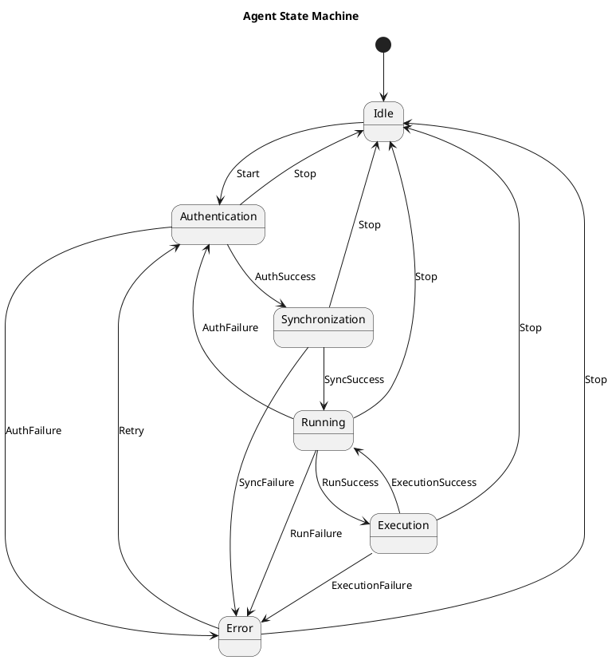

# Table of Contents

- [About the project](#about-the-project)
- [Built With](#built-with)
- [Architectural design](#architectural-design)
  - [Server design](#server-design)
  - [Agent design](#agent-design)
- [Connection and communication](#connection-and-communication)

# About the project

This project is a monitoring agent-based system that collects various system metrics such as
CPU usage, memory usage, disk usage, and network activity. The agent is designed to run as a Windows
service, allowing it to operate in the background and start automatically when the system boots up.
The collected metrics are then sent to a central server for analysis and visualization. The agent
can retrieve instructions from the server, allowing for dynamic configuration and control. The client
is integrated with an AI assistant to describe instruction problems and solutions.

# Built With

- C# .Net 10
- Grafana
- ClickHouse
- PostgreSQL
- ReactJS Typescript

# Architectural design

This section describes the architectural design of the monitoring agent system, including the server and agent components, their interactions, and the overall system architecture.

#### Server design

The server is designed to handle incoming data from multiple agents. It uses the outbox message pattern to ensure reliable data processing and delivery.
The server stores the collected metrics and instruction results in a database, then instruction and metric workers process the
data and store the processed data in ClickHouse or PostgreSQL for analysis and visualization. The server also provides a web interface for users
to view the collected metrics via Grafana iframe, and a custom UI for agent management and instruction execution.

#### Agent design

foto here

The agent is designed to run as a Windows service, allowing it to operate in the background and start automatically when the system boots up.
Communication between the agent and the server is established via mTLS, ensuring secure data transmission. When there is no connection with the server,
the agent will store the collected metrics locally and send them to the server once the connection is re-established.
The response to metric requests includes instructions to execute, which can be used to dynamically configure the agent's behavior and control its operations.

# Connection and communication

The system uses mutual TLS (mTLS) authentication to establish secure communication between agents and the server. This ensures that both the agent and server verify each other's identity before exchanging data.

**Communication Flow:**

1. **Enrollment** - Admin creates a one-time enrollment token via UI, which is used by the agent to obtain a client certificate:
   - Admin generates enrollment token (32-byte random, SHA-256 hashed with salt)
   - Agent sends CSR (Certificate Signing Request) with token to Ingest Server (HTTP)
   - Server validates token, signs certificate with internal CA, stores it in database
   - Agent receives certificate and CA cert, stores them in Windows Certificate Store

2. **mTLS Handshake** - Agent establishes secure connection with Ingest Server:
   - Agent initiates TLS connection with client certificate (HTTPS port 5141)
   - Server validates certificate signature against CA
   - Server checks certificate in database (active, not revoked, not expired)
   - Server creates authenticated session with claims (AgentName, Thumbprint, Serial)

3. **Synchronization** - After TLS connection is established, the agent synchronizes hardware and config information with the server:
   - Agent sends: OS version, machine name, processor count, memory, current configuration
   - Server updates agent record in database with hardware info
   - Server responds with configuration (intervals, limits, allowed collectors/instructions)

4. **Heartbeat Loop** - Agent continuously reports metrics and receives instructions:
   - Agent collects system metrics (CPU, memory, disk, network)
   - Agent sends metrics + instruction results to server via POST /report
   - Server stores data as outbox messages for async processing
   - Server responds with pending instructions for the agent to execute
   - Agent executes instructions and stores results locally until next heartbeat

5. **Certificate Lifecycle** - Automatic renewal and revocation handling:
   - Agent automatically renews certificate before expiration (configurable threshold)
   - Admin can revoke certificates via UI, blocking agent access immediately
   - Revoked agents can re-enroll using a new enrollment token

All communication after initial enrollment is secured with mTLS, ensuring end-to-end encryption and mutual authentication. When offline, the agent stores metrics locally (SQLite) and syncs when connection is restored.

## Agent State Machine

The agent operates using a state machine pattern to manage its lifecycle and ensure reliable operation. The state machine handles authentication, synchronization, metric collection, instruction execution, and error recovery.

**State Descriptions:**

- **Idle**: Initial state when the agent service starts. Waits for the start trigger.

- **Authentication**: Validates or obtains mTLS certificate:
  - Checks if valid certificate exists in Windows Certificate Store
  - If no certificate exists, performs enrollment using enrollment token
  - If certificate is expiring soon, performs renewal via mTLS
  - If certificate is revoked, attempts re-enrollment
  - Transitions to Synchronization on success, or Error on failure

- **Synchronization**: Initial handshake with server after authentication:
  - Sends hardware information (OS version, machine name, processors, memory)
  - Sends current agent configuration
  - Receives server configuration settings
  - Updates agent state with server response
  - Transitions to Running on success, or Error on failure

- **Running**: Main operational state with heartbeat loop:
  - Collects system metrics (CPU, memory, disk, network) via configured collectors
  - Retrieves stored instruction results from local database
  - Sends metrics and instruction results to server via POST /report
  - Receives pending instructions from server
  - Stores instructions in local database for execution
  - Waits for configured interval (RunningExitIntervalSeconds)
  - Transitions to Execution if instructions exist, or loops back to Running

- **Execution**: Executes pending instructions from the server:
  - Retrieves pending instructions from local database (up to configured limit)
  - Executes instructions based on type:
    - **Shell Command**: Executes PowerShell/CMD commands and captures output
    - **GPO Update**: Applies Windows Group Policy changes
    - **Config Update**: Modifies agent configuration (collectors, executors, intervals)
  - Stores execution results in local database
  - Waits for configured interval (ExecutionExitIntervalSeconds)
  - Transitions back to Running to report results

- **Error**: Error recovery state with exponential backoff:
  - Logs error details for debugging
  - Waits for configured interval (AuthenticationExitIntervalSeconds)
  - Automatically retries by transitioning to Authentication
  - Can be stopped manually via service control

**Triggers:**

- `Start`: Service starts → moves from Idle to Authentication
- `Stop`: Service stops → returns to Idle from any state
- `AuthSuccess` / `AuthFailure`: Authentication result
- `SyncSuccess` / `SyncFailure`: Synchronization result
- `RunSuccess` / `RunFailure`: Running state result (has instructions or error)
- `ExecutionSuccess` / `ExecutionFailure`: Instruction execution result
- `Retry`: Automatic retry from Error state

The state machine ensures that the agent always recovers from errors and maintains a consistent operational flow. All state transitions are logged for monitoring and debugging purposes.

