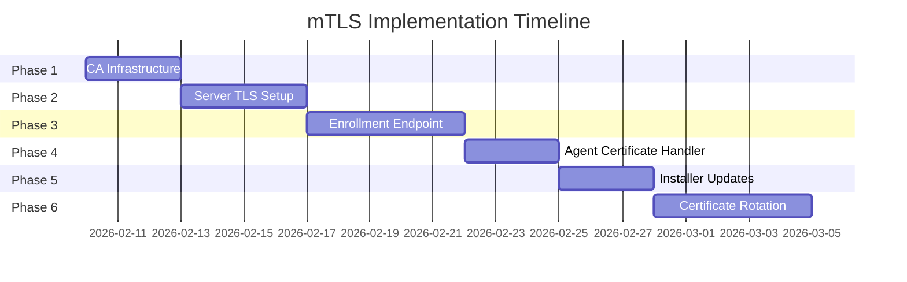

# mTLS Implementation Plan for Agent-Server Communication

## 📋 Overview

**Мета:** Реалізувати взаємну TLS (mTLS) автентифікацію між Windows Service агентами та ASP.NET Core сервером для підвищення безпеки комунікації.

**Поточний стан:** Агенти комунікують з сервером через HTTP + JWT автентифікацію.

**Цільовий стан:** mTLS автентифікація на транспортному рівні з JWT для авторизації (claims/roles).

---

## 🎯 Executive Summary

| Аспект | Оцінка |
|--------|--------|
| **Загальна оцінка плану** | B+ (Добре з незначними прогалинами) |
| **Орієнтовний час реалізації** | 15-23 робочих дні |
| **Рівень ризику** | Середній |
| **Рекомендація** | Впроваджувати поетапно з пілотом на 1-2 агентах |

---

## ✅ Сильні сторони плану

1. **Defense-in-depth підхід** — mTLS + JWT створюють два незалежних шари автентифікації
2. **Правильний розподіл відповідальності** — Чітке розділення CA інфраструктури, серверної конфігурації, агентської конфігурації та provisioning
3. **Інтеграція з інсталятором** — Врахування необхідності certificate provisioning через Inno Setup
4. **Bootstrap workflow** — Розуміння потреби безпечного enrollment для нових агентів

---

## ⚠️ Потенційні проблеми та прогалини

### 1. Certificate Lifecycle Gap
Не згадано:
- Ротація сертифікатів
- Revocation (CRL/OCSP)
- Моніторинг терміну дії

### 2. Bootstrap Security Chicken-and-Egg
Як неавтентифікований агент безпечно отримує свій клієнтський сертифікат? Потрібно використовувати існуючий `SecretKey` як trust anchor.

### 3. Windows Certificate Store Complexity
Використання Windows Certificate Store (vs PFX файли з DPAPI захистом) додає складності для permissions сервісного акаунту.

### 4. Docker/Kestrel mTLS Configuration
Поточний Dockerfile не має TLS. mTLS вимагає Kestrel конфігурацію або reverse proxy — план не специфікує який підхід.

### 5. JWT Redundancy Question
Якщо mTLS забезпечує mutual authentication, чи потрібен JWT? Потрібно уточнити чи зберігати JWT для авторизації чи відмовитись.

### 6. HttpClient Handler Changes
Існуючий `HttpServerClient` використовує `SocketsHttpHandler`. Потрібна конфігурація `SslOptions.ClientCertificates`.

---

## 📝 Детальний план реалізації

### Фаза 1: Підготовка CA Infrastructure

**Тривалість:** 2-3 дні
**Складність:** Середня
**Ризик:** Низький

#### Завдання:
1. Створити новий проект `Server.CertificateAuthority` або додати CA сервіси до `Server.Api`
2. Реалізувати self-signed root CA для внутрішнього використання
3. Створити intermediate CA для підпису агентських сертифікатів

#### Endpoints:
```
POST /api/v1/agents/certificates/enroll   - CSR submission
POST /api/v1/agents/certificates/renew    - Certificate renewal
GET  /api/v1/agents/certificates/status   - Certificate status check
```

#### Database (Certificates table):
```sql
CREATE TABLE certificates (
    id SERIAL PRIMARY KEY,
    serial_number VARCHAR(64) UNIQUE NOT NULL,
    thumbprint VARCHAR(64) UNIQUE NOT NULL,
    agent_id INTEGER REFERENCES agents(id),
    subject_name VARCHAR(256) NOT NULL,
    issued_at TIMESTAMP NOT NULL,
    expires_at TIMESTAMP NOT NULL,
    revoked_at TIMESTAMP NULL,
    revocation_reason VARCHAR(128) NULL,
    created_at TIMESTAMP DEFAULT NOW()
);
```

#### Специфікація сертифікатів:
- **Subject:** `CN={AgentName}` (відповідає полю `Name` в Agent.cs)
- **EKU:** Client Authentication (1.3.6.1.5.5.7.3.2)
- **Validity:** 1 рік з автоматичною ротацією при 80% lifetime
- **Key Size:** RSA 2048 або ECDSA P-256

---

### Фаза 2: Server TLS Setup

**Тривалість:** 2-4 дні
**Складність:** Середньо-Висока
**Ризик:** Середній

#### Варіант A: Kestrel (рекомендовано для простоти)

```csharp
// Program.cs
builder.WebHost.ConfigureKestrel(options =>
{
    // Звичайний HTTPS для UI/Admin
    options.Listen(IPAddress.Any, 8443, listenOptions =>
    {
        listenOptions.UseHttps(httpsOptions =>
        {
            httpsOptions.ServerCertificate = serverCert;
            httpsOptions.ClientCertificateMode = ClientCertificateMode.RequireCertificate;
            httpsOptions.ClientCertificateValidation = (cert, chain, errors) =>
            {
                // Custom validation logic
                return ValidateAgentCertificate(cert, chain);
            };
        });
    });

    // mTLS endpoint for agents
    options.Listen(IPAddress.Any, 8080);
});
```

#### Варіант B: Reverse Proxy (nginx/Traefik)

```yaml
# docker-compose.yaml addition
services:
  traefik:
    image: traefik:v2.10
    command:
      - "--entrypoints.websecure.address=:8443"
      - "--entrypoints.websecure.http.tls.options=mtls@file"
    volumes:
      - ./certs:/certs:ro
```

#### Рекомендація:
Використовувати **Kestrel** для простоти на початку, перейти на reverse proxy при масштабуванні.

---

### Фаза 3: Enrollment Endpoint

**Тривалість:** 3-5 днів
**Складність:** Висока
**Ризик:** Середній

#### Workflow:
```
1. Agent генерує key pair (RSA 2048)
2. Agent створює CSR з CN=AgentName
3. Agent надсилає CSR + ClientSecret на /api/v1/agents/enroll
4. Server валідує ClientSecret (існуюча логіка AgentAuthHandler)
5. Server підписує CSR через intermediate CA
6. Server зберігає certificate metadata в БД
7. Server повертає signed certificate
8. Agent зберігає certificate + private key через DPAPI
```

#### Enrollment Token (альтернатива):
```csharp
public class EnrollmentToken
{
    public Guid Id { get; set; }
    public string Token { get; set; } // SHA256 hash
    public string AgentName { get; set; }
    public DateTime ExpiresAt { get; set; }
    public bool IsUsed { get; set; }
    public DateTime? UsedAt { get; set; }
}
```

---

### Фаза 4: Agent Certificate Handler

**Тривалість:** 2-3 дні
**Складність:** Середня
**Ризик:** Низький

#### Зміни в HttpServerClient:

```csharp
// Program.cs
services.AddHttpClient<IServerClient, HttpServerClient>(client =>
{
    client.BaseAddress = new Uri(serverUrl);
})
.ConfigurePrimaryHttpMessageHandler(sp =>
{
    var certStore = sp.GetRequiredService<ICertificateStore>();
    var handler = new SocketsHttpHandler
    {
        SslOptions = new SslClientAuthenticationOptions
        {
            ClientCertificates = new X509CertificateCollection
            {
                certStore.GetClientCertificate()
            },
            RemoteCertificateValidationCallback = (sender, cert, chain, errors) =>
            {
                // Validate server certificate
                return ValidateServerCertificate(cert, chain, errors);
            }
        }
    };
    return handler;
});
```

#### ICertificateStore Interface:

```csharp
public interface ICertificateStore
{
    X509Certificate2? GetClientCertificate();
    void StoreCertificate(X509Certificate2 certificate);
    void StorePrivateKey(RSA privateKey);
    bool HasValidCertificate();
    DateTime? GetCertificateExpiry();
    bool NeedsRenewal(int daysThreshold = 30);
}
```

#### Реалізація (DPAPI-based):

```csharp
public class DpapiCertificateStore : ICertificateStore
{
    private readonly string _certPath;
    private readonly string _keyPath;

    public DpapiCertificateStore(IOptions<CertificateOptions> options)
    {
        _certPath = Path.Combine(
            Environment.GetFolderPath(Environment.SpecialFolder.CommonApplicationData),
            "Manager", "certs", "agent.pfx"
        );
    }

    public X509Certificate2? GetClientCertificate()
    {
        if (!File.Exists(_certPath)) return null;

        var encryptedBytes = File.ReadAllBytes(_certPath);
        var decryptedBytes = ProtectedData.Unprotect(
            encryptedBytes,
            null,
            DataProtectionScope.LocalMachine
        );

        return new X509Certificate2(decryptedBytes);
    }

    public void StoreCertificate(X509Certificate2 certificate)
    {
        var pfxBytes = certificate.Export(X509ContentType.Pfx);
        var encryptedBytes = ProtectedData.Protect(
            pfxBytes,
            null,
            DataProtectionScope.LocalMachine
        );

        Directory.CreateDirectory(Path.GetDirectoryName(_certPath)!);
        File.WriteAllBytes(_certPath, encryptedBytes);
    }
}
```

---

### Фаза 5: Installer Updates

**Тривалість:** 2-3 дні
**Складність:** Середня
**Ризик:** Середній

#### Зміни в Agent.WindowsService.iss:

```iss
[Setup]
; ... existing setup ...

[Code]
var
  CertPath: String;
  EnrollmentToken: String;

procedure InitializeWizard;
begin
  // Add certificate provisioning page
  CertPath := ExpandConstant('{param:CERTPATH}');
  EnrollmentToken := ExpandConstant('{param:ENROLLMENTTOKEN}');
end;

procedure CurStepChanged(CurStep: TSetupStep);
begin
  if CurStep = ssPostInstall then
  begin
    if CertPath <> '' then
    begin
      // Import pre-provisioned certificate
      ImportCertificate(CertPath);
    end
    else if EnrollmentToken <> '' then
    begin
      // Trigger enrollment with token
      RunEnrollment(EnrollmentToken);
    end;
  end;
end;
```

#### Нові параметри командного рядка:

| Параметр | Опис |
|----------|------|
| `/CERTPATH=path` | Шлях до pre-provisioned PFX |
| `/CERTPASSWORD=pwd` | Пароль для PFX |
| `/ENROLLMENTTOKEN=token` | One-time enrollment token |
| `/SKIPENROLLMENT` | Пропустити enrollment (для debug) |

---

### Фаза 6: Certificate Renewal

**Тривалість:** 3-5 днів
**Складність:** Висока
**Ризик:** Високий

#### Логіка в StateMachine:

```csharp
// StateMachine.Auth.cs
private async Task<AuthResult> CheckCertificateRenewalAsync()
{
    if (_certificateStore.NeedsRenewal(daysThreshold: 30))
    {
        _logger.LogInformation("Certificate expires soon, initiating renewal");

        // Generate new key pair
        using var rsa = RSA.Create(2048);

        // Create CSR
        var csr = CreateCertificateSigningRequest(rsa);

        // Submit renewal request (uses existing mTLS connection)
        var newCert = await _serverClient.RenewCertificateAsync(csr);

        // Store new certificate
        _certificateStore.StoreCertificate(newCert);

        _logger.LogInformation("Certificate renewed successfully");
    }

    return AuthResult.Success;
}
```

---

### Фаза 7: Configuration & Docker

**Тривалість:** 1-2 дні
**Складність:** Низька
**Ризик:** Низький

#### appsettings.json:

```json
{
  "Mtls": {
    "Enabled": true,
    "CaPath": "/certs/ca.crt",
    "ServerCertificatePath": "/certs/server.pfx",
    "ServerCertificatePassword": "",
    "RequireClientCertificate": true,
    "RevocationCheckMode": "Database",
    "MtlsPort": 8443
  }
}
```

#### docker-compose.yaml additions:

```yaml
services:
  server-api:
    # ... existing config ...
    ports:
      - "8080:8080"
      - "8443:8443"  # mTLS port
    volumes:
      - ./certs:/certs:ro
    environment:
      - Mtls__Enabled=true
      - Mtls__CaPath=/certs/ca.crt
```

---

## 📊 Оцінка зусиль

| Компонент | Зусилля | Складність | Ризик |
|-----------|---------|------------|-------|
| CA Infrastructure | 2-3 дні | Середня | Низький |
| Server mTLS (Kestrel) | 2-4 дні | Середньо-Висока | Середній |
| Agent Certificate Handling | 2-3 дні | Середня | Низький |
| Enrollment Workflow | 3-5 днів | Висока | Середній |
| Installer Updates | 2-3 дні | Середня | Середній |
| Certificate Rotation | 3-5 днів | Висока | Високий |
| **Разом** | **15-23 дні** | — | — |

---

## 🔐 Security Considerations

### 1. Private Key Protection
- Агентські приватні ключі повинні використовувати DPAPI (LocalMachine scope)
- Відповідає існуючому паттерну `DpapiSecretStore`

### 2. CA Key Security
- Root CA private key повинен бути offline/HSM
- Intermediate CA може бути software-based з обмеженим доступом

### 3. Certificate Validation
Server повинен валідувати:
- Issuer chain
- Expiry
- CN відповідає зареєстрованому agent name
- Не відкликаний (revoked)

### 4. Bootstrap Window
- Під час enrollment агент автентифікується лише через `ClientSecret`
- Тримати це вікно коротким

### 5. Fallback Handling
- Визначити поведінку при невдалій certificate validation
- Варіанти: reject або fallback на JWT-only з alerting

### 6. Audit Logging
Логувати:
- Всі certificate issuance
- Validation failures
- Enrollment attempts

---

## 🔄 Migration Strategy

### Поступовий rollout:

1. **Фаза A:** Розгортання mTLS на сервері з `ClientCertificateMode.AllowCertificate`
2. **Фаза B:** Оновлення пілотних агентів (1-2) з enrollment
3. **Фаза C:** Моніторинг 1-2 тижні
4. **Фаза D:** Масовий rollout через Ansible
5. **Фаза E:** Перехід на `ClientCertificateMode.RequireCertificate`

---

## 🤔 Відкриті питання

1. **Certificate rotation strategy?**
   - Push-based (server triggers renewal)
   - Pull-based (agent self-renews at 80% lifetime)?

   **Рекомендація:** Agent-initiated (pull-based) відповідає поточній polling-based архітектурі.

2. **Existing agent migration path?**
   - Чи підтримувати gradual rollout де деякі агенти використовують JWT-only?

   **Рекомендація:** Так, на перехідний період.

3. **Revocation mechanism?**
   - CRL (простіше, batch updates)
   - OCSP (real-time, вимагає додаткову інфраструктуру)

   **Рекомендація:** CRL достатньо для поточного масштабу.

---

## 📚 Alternatives Considered

| Підхід | Переваги | Недоліки |
|--------|----------|----------|
| **A. Full mTLS (поточний план)** | Найсильніша безпека, industry standard | Складне PKI ops, навантаження lifecycle |
| **B. mTLS з external CA (Vault PKI)** | Managed rotation, OCSP, proven tooling | Зовнішня залежність, вартість |
| **C. Token-bound certificates (short-lived)** | Не потрібен revocation, простіший lifecycle | Часті renewals (overhead) |
| **D. HTTPS + API keys (enhanced current)** | Мінімальні зміни | Немає mutual authentication |

**Рекомендація:** Варіант A з елементами C (коротша валідність, автоматична ротація).

---

## 📅 Рекомендований порядок реалізації



---

## ✅ Definition of Done

- [x] CA Infrastructure створена та протестована
- [x] Server приймає mTLS з'єднання (endpoints created)
- [x] Agent успішно проходить enrollment (service created)
- [x] Certificate rotation працює автоматично
- [x] Installer підтримує enrollment token
- [x] Документація оновлена
- [ ] Integration tests пройдено
- [ ] Security audit завершено

## 🚀 Implementation Progress - COMPLETED

### Новий спрощений флоу (Enrollment Token Only):

1. **Адмін** генерує одноразовий Enrollment Token на сервері
2. **Інсталятор** приймає Enrollment Token при встановленні агента
3. **Агент** використовує токен для отримання сертифіката
4. **Всі подальші запити** використовують mTLS автоматично
5. **Renewal** відбувається автоматично через mTLS connection

### Видалено:
- JWT автентифікація
- ClientSecret
- AuthToken/RefreshToken
- ISecretStore dependency (крім CertificateEntropy)

### Server Side:
- `CertificateAuthority` - внутрішній CA для підпису сертифікатів
- `CertificateAuthenticationExtensions` - mTLS auth handler
- `/api/v1/agents/certificates/enroll/token` - enrollment через token
- `/api/v1/agents/certificates/renew` - renewal через mTLS
- `/api/v1/admin/certificates/tokens` - створення enrollment tokens

### Agent Side:
- `ICertificateStore` / `DpapiCertificateStore` - зберігання сертифікатів
- `ICertificateEnrollmentService` - enrollment через token
- Автоматичний renewal при наближенні expiry
- HttpClient з mTLS client certificate

---

## 📖 References

- [Microsoft Docs: Configure certificate authentication in ASP.NET Core](https://docs.microsoft.com/en-us/aspnet/core/security/authentication/certauth)
- [mTLS in ASP.NET Core](https://devblogs.microsoft.com/dotnet/configuring-certificate-authentication-in-asp-net-core/)
- [DPAPI for certificate protection](https://docs.microsoft.com/en-us/dotnet/api/system.security.cryptography.protecteddata)
